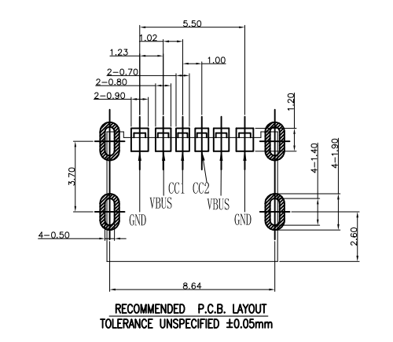
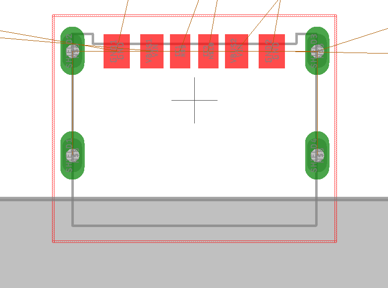
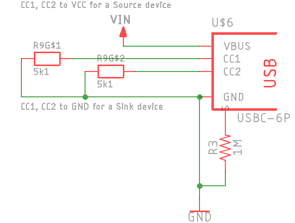

# USBC6P
Surface mount footprints for an easy-to-solder, 6-pin SMD USB-C connector. 

Please note that this connector only connects *Vbus, Gnd, CC1, and CC2*. It does *not* pass D+ or D- data lines, or any of the other USB 2 or 3 pins.

Part numbers include USCX-06FX-XXMX-01.

 

[Datasheet link](Datasheets/USCX-06FX-XXMX-01.pdf)

## Why use it?

- Much easier to solder
- No active negotiation to get 5V (as long as you include properly placed 5.1k resistors on CC1 and CC2)

## Where to find the connector

Try searching, say, AliExpress for the phrase, `usb-c 6p smd`

LCSC has it as "SHOU HAN TYPE-C 6P" (part no. C456012)

## What's included

Currently, Eagle footprints, a design block, and datasheet.

Do you have footprints for KiCad or another tool? Pull requests are welcomed.

## How to place resistors

There are a lot of different opinions about how to connect the shield to reduce EMI. I personally like to add a 1M resistor between the 'S' (shield) and GND; you might also consider an RC network, LC network, or directly attaching to ground, depending on your device's particulars. The nice thing about adding at least one resistor/capacitor footprint is that you can always just fit it with a 0R resistor to directly connect it later--or remove it to disconnect.

More about grounding USB connectors: [one](https://www.reddit.com/r/AskElectronics/comments/7in4a5/should_the_usb_connector_be_grounded/) [two](https://electronics.stackexchange.com/questions/389972/usb-shield-to-ground-or-not-to-ground)

Then you need to decide whether your device is a *Sink* (accepts current) or *Source* (provides current) device. 

### Sink

Place *two separate* 5.1k resistors between CC1/CC2 to GND.

### Source

Place *two separate* 5.1k resistors between CC1/CC2 to Vbus.

### What if I forget the resistors or use only one?

Fancy power supplies will [deem your device unworthy of juice](https://hackaday.com/2019/07/16/exploring-the-raspberry-pi-4-usb-c-issue-in-depth/). Dumb power supplies won't care. 

### What's this zany looking multi-resistor?

The included Eagle design block (.dbl) uses a single 4-pack resistor (4x0603 -> ~1206 footprint, Bourns part no. CAY16-512J4LF) because they are terribly convenient. It's got two spare resistors for you to use somewhere else. 

You can also use regular resistors of any size you like!

## I spotted something wrong.

GitHub issues are welcomed. Thanks in advance!
